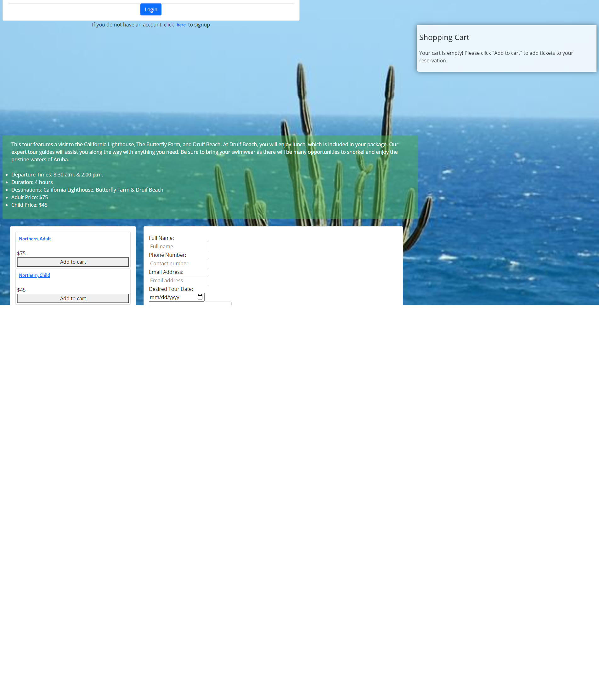

# aruba-jeep-tours
An app designed to find, reserve, and pay for tour packages for jeep tours in Aruba.

## Table of contents
* [User Story](#user-story)
* [Deployed Website](#deployedwebsite)
* [Description & Features](#description)
* [Screenshots](#screenshots)
* [Tech/Framework](#tech/framework)
* [Credits](#credits)
* [License](#license)

## User Story
```
    AS the owner of a small jeep tour business in Aruba, 
    I WANT to be able to show available tours and packages to customers planning trips to Aruba and be able to take reservations and payments through the website, 
    SO THAT it is easier to manage and grow my business
```
## Deployed Website

https://shielded-dusk-02329.herokuapp.com/


## Description

This application is designed to assist a small business owner to better manage their business. Customers are able to sign up and log in to the website, view tour packages, select desired tour and fill out the form to make their reservation. This reservation is saved to the database and the owner can view added reservations in Robo3T. The customer can then click the complete and pay button where they are redirected to Stripe and can submit their payment. This payment is saved in the Stripe website for easy viewing and matching with reservations by the owner. Customers that are logged in are also able to post reviews. These reviews are visible on each page and will populate new reviews as they are added.  

## Features

* If the user signs up, they can log in.

* Once logged in, users can make reservations, payments, and post reviews.

* The Admin/Owner of the website can view payments on their Stripe account and reservations on the database by checking Robo3T.


## Screenshots





## Tech/Framework

- VS Code
- JavaScript
- React
- Bootstrap
- Mongoose
- Cloudinary
- MongoAtlas
- Apollo


## Credits

Alexandra Hurst [GitHub Profile](https://github.com/AlNHurst)

Jess Greene [GitHub Profile](https://github.com/jessgreene9)


## License

[](https://opensource.org/licenses/MIT)